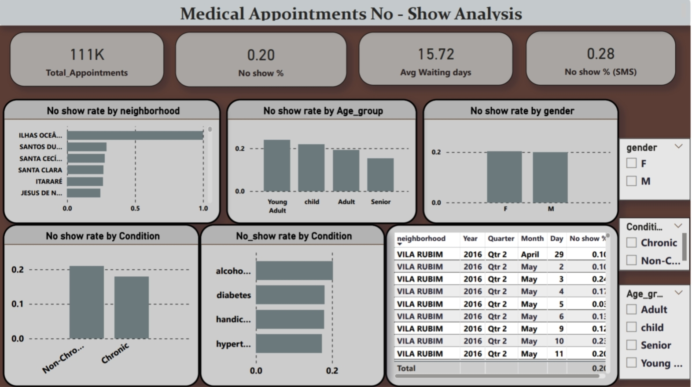

# Healthcare Appointment No-Show Analysis

## Overview
Analyzed 111,000+ healthcare appointment records to find patterns behind patient no-shows. Built the same analysis four times across **SQL, Python — same KPIs, same logic, ported language to language — to demonstrate cross-tool fluency for CRO/pharma data roles that expect comfort in more than one stack.

---

## Dataset
- **Source:** Kaggle — Medical Appointment No Shows
- **Link:** https://www.kaggle.com/datasets/joniarroba/noshowappointments
- **Size:** 111,000+ appointment records

Columns used: `patient_id`, `appointment_id`, `gender`, `age`, `neighborhood`, `scholarship`, `hypertension`, `diabetes`, `alcoholism`, `handicap`, `sms_received`, `scheduled_day`, `appointment_day`, `no_show`

---

## What I did
- Cleaned the dataset — removed negative-age rows, validated date logic (appointment date can't precede scheduled date)
- Calculated no-show KPIs, waiting-period buckets, age-group and gender breakdowns, SMS-reminder effectiveness, and chronic-condition (hypertension/diabetes/alcoholism) comparisons
- Ranked neighborhoods by no-show rate using window functions (`RANK() OVER`) in SQL.
- Built a rule-based high-risk segment: no SMS reminder + 15+ day wait + no chronic condition
- Ported the full analysis across SQL, Python (Pandas/Matplotlib) so the same numbers reproduce in every tool

---

## Dashboard KPIs
| Metric               | Value |
| --------------------- | ----- |
| Total Appointments     | 111K+ |
| Overall No-Show Rate   | ~20%  |
| Average Waiting Days   | 10.18 |
| No-Show % with SMS     | 27.6% |

---

## Key Findings
- Overall no-show rate was around **20%**
- **Teen** and **Young Adult** age groups had the highest no-show rates
- Longer waiting days between scheduling and appointment increased no-show probability
- SMS reminders alone did not reduce no-shows significantly
- Patients with chronic conditions showed slightly better attendance

---

## Output Preview



---

## Files
```
├── Medical appointments sql       — SQL queries (KPIs, age/waiting-period buckets, window-function ranking)
├── appointments.py                — Python EDA + visualizations
├── medical appointment data.xlsx  — raw dataset
├── IMG_20260220_223623.jpg        — analysis output preview (phone photo — replace with a real screenshot)
```
